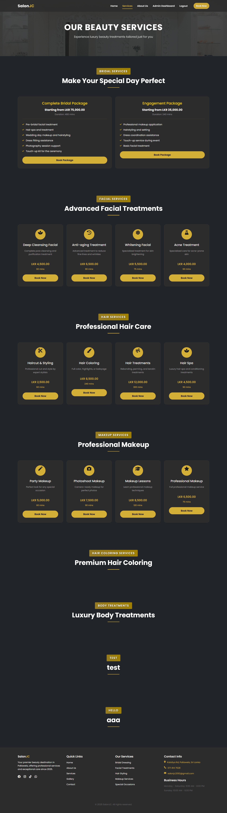

# SalonJC - Salon Management System

## 📋 Overview

SalonJC is a comprehensive salon management system built with Laravel, designed to streamline the operations of beauty salons and spa facilities. The system offers an intuitive interface for both customers and administrators, facilitating easy booking management, service scheduling, and customer feedback.

## ✨ Features

### 🔐 User Management

-   Customer registration and authentication
-   Profile management with photo upload
-   Role-based access control (Admin/Customer)

### 💇‍♀️ Services Management

-   Service categories organization
-   Detailed service listings with images
-   Service pricing and duration management
-   Feature highlights for services

### 📅 Booking System

-   Online appointment scheduling
-   Real-time availability checking
-   Booking confirmation system
-   Status tracking (Pending, Confirmed, Completed, Cancelled)

### 👩‍💼 Specialist Management

-   Specialist profiles
-   Service-specialist mapping
-   Availability management

### ⭐ Customer Feedback

-   Post-service feedback system
-   Rating and review management
-   Public reviews display

### 📊 Admin Dashboard

-   Comprehensive booking management
-   Service and category management
-   Feedback monitoring
-   Business analytics

Laravel is a web application framework with expressive, elegant syntax. We believe development must be an enjoyable and creative experience to be truly fulfilling. Laravel takes the pain out of development by easing common tasks used in many web projects, such as:

-   [Simple, fast routing engine](https://laravel.com/docs/routing).
-   [Powerful dependency injection container](https://laravel.com/docs/container).
-   Multiple back-ends for [session](https://laravel.com/docs/session) and [cache](https://laravel.com/docs/cache) storage.
-   Expressive, intuitive [database ORM](https://laravel.com/docs/eloquent).
-   Database agnostic [schema migrations](https://laravel.com/docs/migrations).
-   [Robust background job processing](https://laravel.com/docs/queues).
-   [Real-time event broadcasting](https://laravel.com/docs/broadcasting).

Laravel is accessible, powerful, and provides tools required for large, robust applications.

## Learning Laravel

Laravel has the most extensive and thorough [documentation](https://laravel.com/docs) and video tutorial library of all modern web application frameworks, making it a breeze to get started with the framework.

You may also try the [Laravel Bootcamp](https://bootcamp.laravel.com), where you will be guided through building a modern Laravel application from scratch.

If you don't feel like reading, [Laracasts](https://laracasts.com) can help. Laracasts contains thousands of video tutorials on a range of topics including Laravel, modern PHP, unit testing, and JavaScript. Boost your skills by digging into our comprehensive video library.

## Laravel Sponsors

We would like to extend our thanks to the following sponsors for funding Laravel development. If you are interested in becoming a sponsor, please visit the [Laravel Partners program](https://partners.laravel.com).

### Premium Partners

-   **[Vehikl](https://vehikl.com)**
-   **[Tighten Co.](https://tighten.co)**
-   **[Kirschbaum Development Group](https://kirschbaumdevelopment.com)**
-   **[64 Robots](https://64robots.com)**
-   **[Curotec](https://www.curotec.com/services/technologies/laravel)**
-   **[DevSquad](https://devsquad.com/hire-laravel-developers)**
-   **[Redberry](https://redberry.international/laravel-development)**
-   **[Active Logic](https://activelogic.com)**

## Contributing

Thank you for considering contributing to the Laravel framework! The contribution guide can be found in the [Laravel documentation](https://laravel.com/docs/contributions).

## Code of Conduct

In order to ensure that the Laravel community is welcoming to all, please review and abide by the [Code of Conduct](https://laravel.com/docs/contributions#code-of-conduct).

## Security Vulnerabilities

If you discover a security vulnerability within Laravel, please send an e-mail to Taylor Otwell via [taylor@laravel.com](mailto:taylor@laravel.com). All security vulnerabilities will be promptly addressed.

## License

The Laravel framework is open-sourced software licensed under the [MIT license](https://opensource.org/licenses/MIT).

## 🛠️ Technology Stack

-   **Backend:** Laravel 10.x
-   **Frontend:** HTML5, CSS3, JavaScript
-   **Styling:** Tailwind CSS
-   **Database:** MySQL
-   **Development Environment:** Laragon
-   **Package Manager:** Composer, NPM

## 📦 Prerequisites

-   PHP >= 8.1
-   Composer
-   Node.js & NPM
-   MySQL
-   Laragon (recommended) or similar local development environment

## ⚙️ Installation

1. **Clone the repository**

    ```bash
    git clone https://github.com/dimuthadithya/salonJC.git
    cd salonJC
    ```

2. **Install PHP dependencies**

    ```bash
    composer install
    ```

3. **Install Node dependencies**

    ```bash
    npm install
    ```

4. **Environment Setup**

    ```bash
    cp .env.example .env
    php artisan key:generate
    ```

5. **Configure Database**

    - Update .env with your database credentials

    ```env
    DB_CONNECTION=mysql
    DB_HOST=127.0.0.1
    DB_PORT=3306
    DB_DATABASE=salonjc
    DB_USERNAME=root
    DB_PASSWORD=
    ```

6. **Run Migrations and Seeders**

    ```bash
    php artisan migrate --seed
    ```

7. **Create storage link**

    ```bash
    php artisan storage:link
    ```

8. **Build assets**

    ```bash
    npm run dev
    ```

9. **Start the development server**
    ```bash
    php artisan serve
    ```

## 🏃‍♂️ Running the Application

Access the application at `http://localhost:8000` or your configured Laragon URL.

### Default Admin Credentials

-   Email: `admin@salonjc.com`
-   Password: `password`

### Default Customer Credentials

-   Email: `customer@example.com`
-   Password: `password`

## 📸 Screenshots

### Home Page


### Services Page



### Booking System


### Admin Dashboard


## 🔒 Security Vulnerabilities

If you discover a security vulnerability within SalonJC, please send an e-mail via [your-email@example.com](mailto:your-email@example.com).

## 📄 License

The SalonJC is open-sourced software licensed under the [MIT license](https://opensource.org/licenses/MIT).

## 👥 Contributors

-   [Your Name](https://github.com/yourusername)

## 🙏 Acknowledgments

-   Laravel Team
-   Tailwind CSS Team
-   All contributors who helped in building this project
